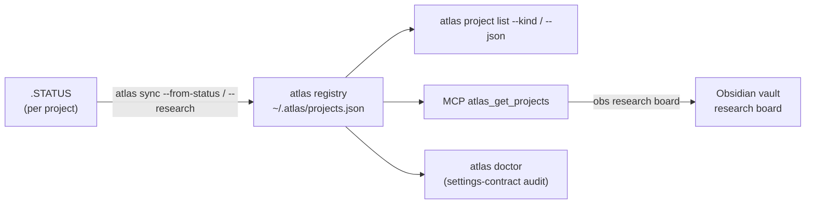

# Research-Ops Platform — Overview

> The cross-cutting front door to the research-ops platform: how `.STATUS`, **atlas**, **obsidian-cli-ops**,
> and the **Project Settings Contract** fit together. Deep references: [ADR-001](../adr/ADR-001-research-ops-ecosystem-ownership.md),
> [ADR-002](../adr/ADR-002-sync-research-ownership.md), [ADR-003](../adr/ADR-003-scanner-depth-policy.md); atlas
> `docs/RESEARCH-REGISTRY.md`, `docs/ARCHITECTURE.md`, `docs/CLI-REFERENCE.md`.

## What it is

A pipeline that turns each project's `.STATUS` file into a **queryable registry** and a **live research board**,
with a contract that keeps every project well-formed and a `doctor` that audits it.

## The pipeline

## Components & ownership (ADR-001)

| Surface | Owns | Key commands |
|--------|------|--------------|
| **`.STATUS`** | single source of project truth (status/priority/progress/next + research `kind`/`target`/`tasks`) | — |
| **atlas** (Node) | registry engine + auditor | `sync --from-status`/`--research`, `project list --kind`, `doctor`, MCP `atlas_get_projects` |
| **obsidian-cli-ops** (obs) | vault authority | `obs link` (`.obs/sync.yml`), `obs research board` (atlas → vault) |
| **docs-standards** | the contract + ADRs | this overview, ADR-001/002/003, Project Settings Contract |

## Sync ownership (ADR-002)

- **`--from-status`** (or the **`--research`** alias) is the **authority** for research metadata.
- A plain **`atlas sync`** is packages-only: it **preserves** existing `kind`/`target`/`tasks` and **warns**
  (naming the research projects it did not refresh), but never strips them. *(History: #36 strip bug → #37
  preserve → #40 warn.)*

## Scanner policy (ADR-003)

- A project directory is a scan **leaf** by default (umbrella-only).
- A **`.atlas-scan-children`** marker opts an umbrella in to having its child repos scanned too (bounded by `scanDepth`).

## The Project Settings Contract

Every project carries, and `atlas doctor` audits:

| Setting | Required | Owner |
|---------|----------|-------|
| `.STATUS` | yes (error if missing) | scaffolder |
| `CLAUDE.md` | yes (warn if missing) | scaffolder |
| `.obs/sync.yml` | yes (`mirror: none` for non-vault) | `obs link` |
| atlas registration | yes | scaffolder / `atlas sync` |

## Releases

- **atlas v0.12.0** — research registry, `atlas doctor`, research-safe sync (`--research` + warning), venue-comment
  parse, `.atlas-scan-children` marker.
- **obsidian-cli-ops v4.x** — `obs link`, `obs research board`.

## Known follow-ups

- **atlas #49 (FW-30)** — unify the project id scheme between `--from-status` (name-slug) and plain sync (path) to
  eliminate duplicate entries when from-status registers first.
- ADR-002 option C — consider making `--from-status` the default sync after a scan benchmark.
